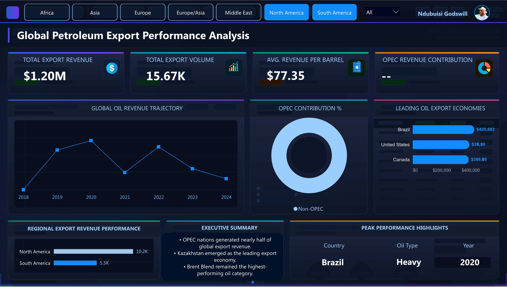

# Global Petroleum Export Performance Analysis

Global petroleum export analytics project built with PostgreSQL, SQL, DAX, and Power BI, featuring executive KPI reporting, revenue trend analysis, OPEC contribution insights, and interactive dashboard visualization.

This project demonstrates a complete analytics workflow:
- Data cleaning and transformation in SQL
- KPI engineering and business logic creation
- Data modeling for reporting
- Interactive dashboard development in Power BI
- Executive-level business storytelling through visualization

---

# Dashboard Preview

## Main Dashboard View

<p align="center">
  
</p>


## Dashboard with Regional Slicer Applied



---

# Project Objectives

The goal of this project was to:
- Analyze global petroleum export performance
- Identify top-performing exporting economies
- Compare OPEC vs Non-OPEC contribution
- Evaluate oil profitability patterns
- Track revenue trends across years
- Build a premium executive-style analytics dashboard

---

# Tools & Technologies Used

| Tool | Purpose |
|---|---|
| PostgreSQL | Data cleaning, transformation, analytics engineering |
| PgAdmin4 | SQL development environment |
| Power BI | Dashboard creation and business intelligence reporting |
| DAX | KPI calculations and dynamic insights |
| SQL Window Functions | Ranking, trend analysis, growth metrics |
| Power Query | Data connection and transformation |
| GitHub | Portfolio hosting and project documentation |

---

# SQL Engineering Tasks Performed

The SQL workflow focused heavily on real-world analytics engineering practices.

## Data Cleaning
- Removed null records
- Standardized text formatting using `TRIM()` and `INITCAP()`
- Converted data types using `CAST()`
- Created readable month names
- Built year-month fields for time intelligence

## Feature Engineering

Created:
- Quarter classifications
- Revenue categories
- Volume categories
- OPEC / Non-OPEC segmentation
- Revenue per barrel calculations

## KPI Engineering

Built executive metrics such as:
- Total export revenue
- Total export volume
- Average revenue per barrel
- OPEC revenue contribution %
- Export transaction counts

## Advanced SQL Analytics

Implemented:
- `RANK()` window functions
- `DENSE_RANK()`
- `LAG()` for growth analysis
- CTEs for modular query design
- Aggregation and profitability analysis

## Data Modeling

A production-style SQL view was created:

```sql
vw_global_exports_analytics
```

This view became the primary reporting table connected directly into Power BI.

---

# Key Business Insights

## OPEC Dominance

OPEC nations contributed nearly half of total global export revenue, highlighting continued influence in global petroleum trade.

## Top Export Economies

Kazakhstan, Nigeria, Russia, Brazil, UAE, and Kuwait consistently ranked among the highest revenue-generating exporters.

## Oil Type Profitability

Brent Blend emerged as the highest-performing oil category based on revenue efficiency and profitability metrics.

## Regional Performance

The Middle East generated the strongest export revenue contribution globally, outperforming other regions significantly.

## Revenue Trends

Export revenue displayed strong fluctuations across reporting years, with noticeable recovery and acceleration in later periods.

## Market Concentration

A relatively small number of countries generated a large share of total export revenue, indicating concentrated export dominance.

---

# Power BI Dashboard Features

## Executive KPI Cards
- Total Export Revenue
- Total Export Volume
- Average Revenue per Barrel
- OPEC Revenue Contribution %

## Interactive Filtering

Users can dynamically filter the dashboard by:
- Region
- Export segment

## Visual Analytics

The dashboard includes:
- Revenue trajectory analysis
- OPEC market contribution visualization
- Top exporting economies ranking
- Regional export performance comparison
- Executive summary insights
- Peak performance indicators

## Design Approach

The dashboard was intentionally designed with:
- Premium dark executive styling
- Minimalist layout
- Strong visual hierarchy
- High readability
- Strategic spacing and storytelling

---

# DAX Measures Created

Several DAX measures were developed for dynamic insights and KPI generation.

## Top Country by Revenue

```DAX
Top Country by Revenue =
VAR TopCountry =
    TOPN(
        1,
        SUMMARIZE(
            vw_global_exports_analytics,
            vw_global_exports_analytics[exporting_country],
            "Revenue", [Total Revenue]
        ),
        [Revenue],
        DESC
    )
RETURN
    CONCATENATEX(
        TopCountry,
        vw_global_exports_analytics[exporting_country],
        ", "
    )
```

## Best Oil Type

```DAX
Best Oil Type =
VAR TopOilType =
    TOPN(
        1,
        SUMMARIZE(
            vw_global_exports_analytics,
            vw_global_exports_analytics[oil_type],
            "Revenue", [Total Revenue]
        ),
        [Revenue],
        DESC
    )
RETURN
    CONCATENATEX(
        TopOilType,
        vw_global_exports_analytics[oil_type],
        ", "
    )
```

## Highest Revenue Year

```DAX
Highest Revenue Year =
VAR TopYear =
    TOPN(
        1,
        SUMMARIZE(
            vw_global_exports_analytics,
            vw_global_exports_analytics[year],
            "Revenue", [Total Revenue]
        ),
        [Revenue],
        DESC
    )
RETURN
    CONCATENATEX(
        TopYear,
        vw_global_exports_analytics[year],
        ", "
    )
```

---

# SQL Highlights

The project utilized:
- Common Table Expressions (CTEs)
- Window Functions
- Ranking Logic
- Growth Analysis
- Conditional KPI Calculations
- Time Intelligence Preparation
- Revenue Segmentation

The SQL architecture was written using production-style formatting and modular query design principles.

---

# Repository Structure

```text
Global-Petroleum-Export-Performance-Analysis/
│
├── SQL/
│   └── global_oil_exports_queries.sql
│
├── Dashboard/
│   └── Global_Oil_Export_Analysis.pbix
│
├── assets/
│   ├── dashboard-main.png
│   └── dashboard-middle-east.png
│
└── README.md
```

---

# Project Outcome

This project demonstrates:
- SQL analytics engineering
- Power BI dashboard design
- KPI modeling
- Executive business reporting
- Real-world analytics workflow development

It was built to reflect the standards used in modern business intelligence and data analytics environments.

---

# Author

## Ndubuisi Godswill

Data Analytics | SQL | Power BI | Business Intelligence | Data Visualization
