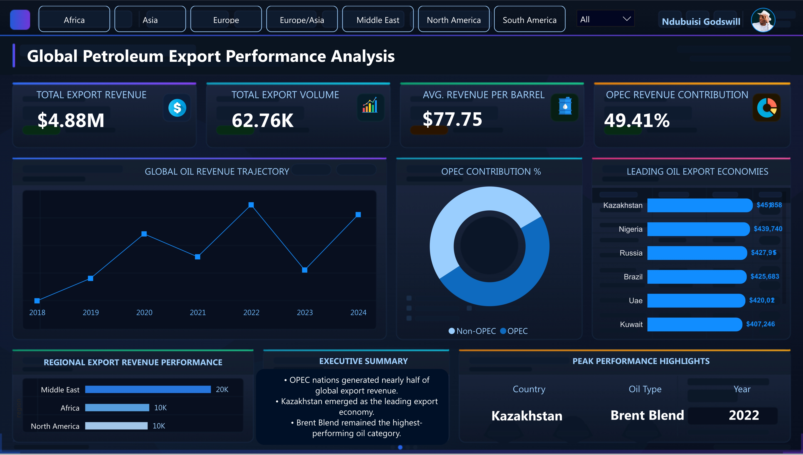

# Global Petroleum Export Performance Analysis

Global petroleum export analytics project built with PostgreSQL, SQL, DAX, and Power BI, featuring executive KPI reporting, revenue trend analysis, OPEC contribution insights, and interactive dashboard visualization.

---




This project demonstrates a complete analytics workflow:
- Data cleaning and transformation in SQL
- KPI engineering and business logic creation
- Data modeling for reporting
- Interactive dashboard development in Power BI
- Executive-level business storytelling through visualization

---

# Project Objectives

The goal of this project was to:
- Analyze global petroleum export performance
- Identify top-performing exporting economies
- Compare OPEC vs Non-OPEC contribution
- Evaluate oil profitability patterns
- Track revenue trends across years
- Build a premium executive-style analytics dashboard

---

# Interactive Dashboard Views

## Africa Regional Analysis
The Africa regional view highlights the continent’s contribution to global petroleum exports, showcasing key exporting economies, revenue performance trends, and the role of African oil markets within the global energy trade landscape.

.jpg)

---

## Americas Regional Analysis
This filtered dashboard provides insight into petroleum export performance across North and South America, revealing regional revenue distribution, export dominance, and comparative market contribution within the global oil industry.

.jpg)

---

## Europe Regional Analysis
The Europe-focused analysis explores export revenue patterns, leading petroleum-exporting nations, and regional trade performance, offering a detailed view of Europe’s position within the international energy export market.

.jpg)

---

# Tools & Technologies Used

| Tool | Purpose |
|---|---|
| PostgreSQL | Data cleaning, transformation, analytics engineering |
| PgAdmin4 | SQL development environment |
| Power BI | Dashboard creation and business intelligence reporting |
| DAX | KPI calculations and dynamic insights |
| SQL Window Functions | Ranking, trend analysis, growth metrics |
| Power Query | Data connection and transformation |
| GitHub | Portfolio hosting and project documentation |

---

# SQL Analytics Engineering

PostgreSQL was used to perform end-to-end analytics engineering and prepare the dataset for business intelligence reporting in Power BI.

The SQL workflow included:
- Data cleaning and null handling
- Text standardization using `TRIM()` and `INITCAP()`
- Data type conversion using `CAST()`
- Time intelligence preparation with month, quarter, and year-month fields
- Feature engineering for revenue and volume segmentation
- OPEC vs Non-OPEC classification
- Revenue-per-barrel calculations
- Executive KPI engineering
- Ranking and profitability analysis
- Time-series trend analysis using window functions
- Production-style data modeling through a reusable analytics view

The transformed SQL view served as the primary reporting table connected directly into Power BI for dashboard development and interactive analytics.

[View Full SQL Query Documentation](./SQL/global_exports_analysis.sql)

---

# Key Business Insights

## OPEC Dominance

OPEC nations contributed nearly half of total global export revenue, highlighting continued influence in global petroleum trade.

## Top Export Economies

Kazakhstan, Nigeria, Russia, Brazil, UAE, and Kuwait consistently ranked among the highest revenue-generating exporters.

## Oil Type Profitability

Brent Blend emerged as the highest-performing oil category based on revenue efficiency and profitability metrics.

## Regional Performance

The Middle East generated the strongest export revenue contribution globally, outperforming other regions significantly.

## Revenue Trends

Export revenue displayed strong fluctuations across reporting years, with noticeable recovery and acceleration in later periods.

## Market Concentration

A relatively small number of countries generated a large share of total export revenue, indicating concentrated export dominance.

---

# Power BI Dashboard Features

## Executive KPI Cards
- Total Export Revenue
- Total Export Volume
- Average Revenue per Barrel
- OPEC Revenue Contribution %

## Interactive Filtering

Users can dynamically filter the dashboard by:
- Region
- Export segment

## Visual Analytics

The dashboard includes:
- Revenue trajectory analysis
- OPEC market contribution visualization
- Top exporting economies ranking
- Regional export performance comparison
- Executive summary insights
- Peak performance indicators

## Design Approach

The dashboard was intentionally designed with:
- Premium dark executive styling
- Minimalist layout
- Strong visual hierarchy
- High readability
- Strategic spacing and storytelling

---

# DAX Measures Documentation

The custom DAX measures used for KPI calculations, ranking logic, dynamic insights, and dashboard interactivity can be accessed below:

[View DAX Measures Documentation](/DAX/dax_measures.md)

```

---

# SQL Highlights

The project utilized:
- Common Table Expressions (CTEs)
- Window Functions
- Ranking Logic
- Growth Analysis
- Conditional KPI Calculations
- Time Intelligence Preparation
- Revenue Segmentation

The SQL architecture was written using production-style formatting and modular query design principles.

---

# Repository Structure

```text
Global-Petroleum-Export-Performance-Analysis/
│
├── README.md
├── assets/
├── SQL/
├── DAX/
└── Dashboard/

```


---

# Project Outcome

This project demonstrates:
- SQL analytics engineering
- Power BI dashboard design
- KPI modeling
- Executive business reporting
- Real-world analytics workflow development

It was built to reflect the standards used in modern business intelligence and data analytics environments.

---

# Author

## Ndubuisi Godswill

Data Analytics | SQL | Power BI | Business Intelligence | Data Visualization
